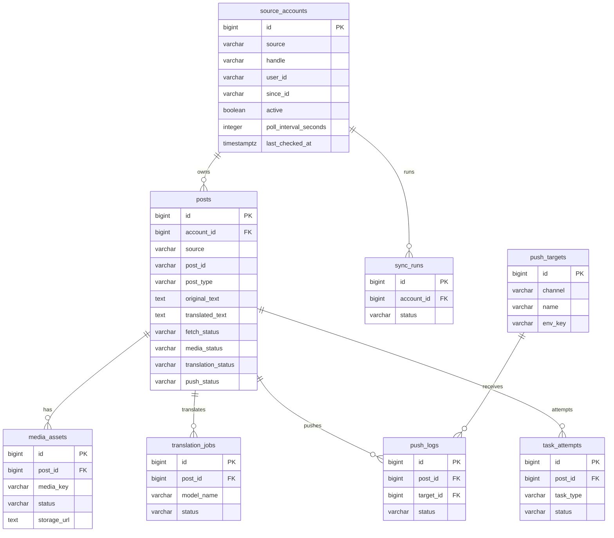
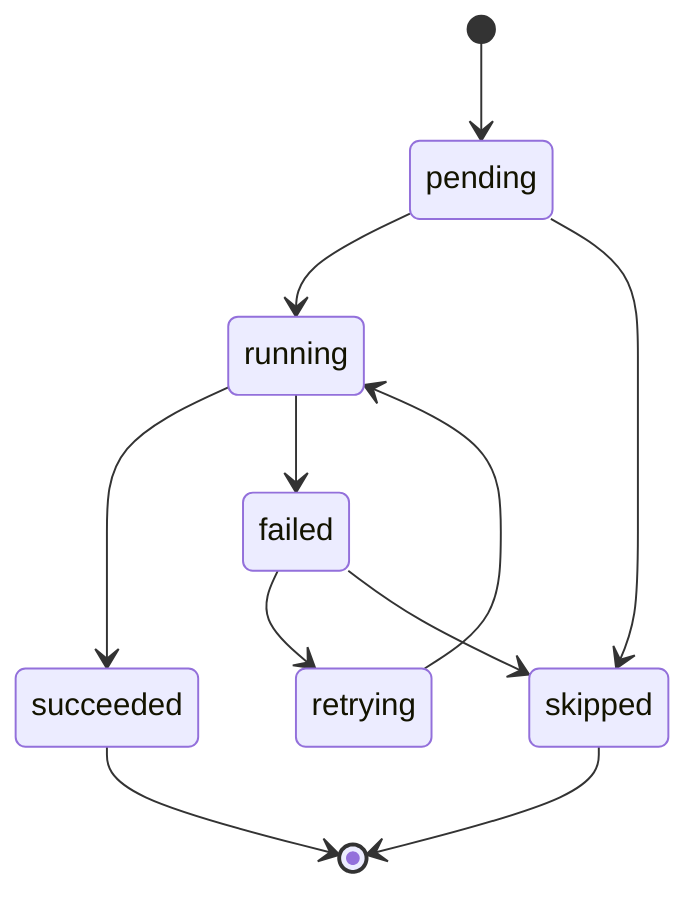

# Serenity 数据库设计

**版本**: v1.0  
**数据库**: PostgreSQL 16  
**目标**: 支撑 X 官方 API 同步、媒体归档、DeepSeek 翻译、飞书推送、运维看板和失败重试。

## 1. 设计原则

- 状态字段使用 `VARCHAR + CHECK`，不使用 PostgreSQL enum，降低后续扩展成本。
- 所有外键都建立索引，避免看板和详情页查询出现 N+1 或全表扫描。
- `raw_json` 使用 `JSONB` 仅用于审计和排障，不作为常规查询条件。
- 大文本字段暂保留在业务表中，避免过早拆分；数据量增长后再做冷热归档。
- webhook、secret、API key 不入库；`push_targets` 只保存目标的非敏感标识。

## 2. ER 图



## 3. 通用状态

状态全集：`pending`、`running`、`succeeded`、`failed`、`retrying`、`skipped`。

适用字段：

- `posts.fetch_status`
- `posts.media_status`
- `posts.translation_status`
- `posts.push_status`
- `media_assets.status`
- `translation_jobs.status`
- `push_logs.status`
- `sync_runs.status`
- `task_attempts.status`

状态流转：



## 4. 表设计

### 4.1 source_accounts

X 账号同步配置和游标。

| 字段 | 类型 | 约束 | 说明 |
|------|------|------|------|
| `id` | `BIGSERIAL` | PK | 内部账号 ID |
| `source` | `VARCHAR(32)` | NOT NULL, default `x` | 来源平台 |
| `handle` | `VARCHAR(128)` | NOT NULL | X handle，不含 `@` |
| `user_id` | `VARCHAR(64)` | nullable | X user id |
| `since_id` | `VARCHAR(64)` | nullable | 下次轮询游标 |
| `active` | `BOOLEAN` | NOT NULL | 是否启用 |
| `poll_interval_seconds` | `INT` | NOT NULL | 账号轮询间隔 |
| `last_checked_at` | `TIMESTAMPTZ` | nullable | 最近检查时间 |
| `created_at` | `TIMESTAMPTZ` | NOT NULL | 创建时间 |
| `updated_at` | `TIMESTAMPTZ` | NOT NULL | 更新时间 |

约束与索引：

- `UNIQUE (source, handle)`
- `CHECK (poll_interval_seconds >= 60)`
- `idx_source_accounts_active` on `(active, last_checked_at)`

### 4.2 posts

帖子主表，服务和看板的核心查询入口。

| 字段 | 类型 | 约束 | 说明 |
|------|------|------|------|
| `id` | `BIGSERIAL` | PK | 内部帖子 ID |
| `account_id` | `BIGINT` | FK -> `source_accounts.id` | 所属账号 |
| `source` | `VARCHAR(32)` | NOT NULL | 来源平台 |
| `post_id` | `VARCHAR(64)` | NOT NULL | X post id |
| `post_url` | `TEXT` | NOT NULL | 原帖链接 |
| `post_type` | `VARCHAR(32)` | NOT NULL | `original/quote/reply/retweet` |
| `referenced_post_id` | `VARCHAR(64)` | nullable | 引用/回复/转帖目标 |
| `conversation_id` | `VARCHAR(64)` | nullable | X conversation id |
| `original_text` | `TEXT` | nullable | 原文 |
| `translated_text` | `TEXT` | nullable | 中文译文 |
| `lang` | `VARCHAR(16)` | nullable | X 语言标识 |
| `published_at` | `TIMESTAMPTZ` | nullable | X 发布时间 |
| `fetched_at` | `TIMESTAMPTZ` | NOT NULL | 抓取入库时间 |
| `translated_at` | `TIMESTAMPTZ` | nullable | 翻译完成时间 |
| `pushed_at` | `TIMESTAMPTZ` | nullable | 推送完成时间 |
| `ready_event_emitted_at` | `TIMESTAMPTZ` | nullable | 内部 ready 事件时间 |
| `fetch_status` | `VARCHAR(32)` | NOT NULL + CHECK | 抓取状态 |
| `media_status` | `VARCHAR(32)` | NOT NULL + CHECK | 媒体归档状态 |
| `translation_status` | `VARCHAR(32)` | NOT NULL + CHECK | 翻译状态 |
| `push_status` | `VARCHAR(32)` | NOT NULL + CHECK | 推送状态 |
| `raw_json` | `JSONB` | nullable | X 原始响应片段 |
| `error_message` | `TEXT` | nullable | 最近错误 |
| `created_at` | `TIMESTAMPTZ` | NOT NULL | 记录创建时间 |
| `updated_at` | `TIMESTAMPTZ` | NOT NULL | 记录更新时间 |

约束与索引：

- `UNIQUE (source, post_id)`，保证幂等。
- `CHECK (post_type IN ('original','quote','reply','retweet'))`
- `idx_posts_account_published` on `(account_id, published_at DESC)`
- `idx_posts_push_status_created` on `(push_status, created_at DESC)`
- `idx_posts_translation_status_created` on `(translation_status, created_at DESC)`
- `idx_posts_failed_partial` on `(created_at DESC)` where any生命周期状态 in `failed/retrying`
- `idx_posts_raw_json_gin` 可选，仅当排障需要按 JSON 字段查询时启用。

### 4.3 media_assets

保存帖子媒体和 COS 归档结果。

| 字段 | 类型 | 约束 | 说明 |
|------|------|------|------|
| `id` | `BIGSERIAL` | PK | 媒体 ID |
| `post_id` | `BIGINT` | FK -> `posts.id` | 所属帖子 |
| `media_key` | `VARCHAR(128)` | nullable | X media key |
| `media_type` | `VARCHAR(32)` | nullable | `photo/video/animated_gif` |
| `original_url` | `TEXT` | nullable | 原始媒体 URL |
| `preview_url` | `TEXT` | nullable | 预览 URL |
| `storage_path` | `TEXT` | nullable | COS object key |
| `storage_url` | `TEXT` | nullable | COS 可访问 URL |
| `alt_text` | `TEXT` | nullable | X alt text |
| `status` | `VARCHAR(32)` | NOT NULL + CHECK | 归档状态 |
| `retry_count` | `INT` | NOT NULL | 重试次数 |
| `error_message` | `TEXT` | nullable | 最近错误 |
| `created_at` | `TIMESTAMPTZ` | NOT NULL | 创建时间 |
| `updated_at` | `TIMESTAMPTZ` | NOT NULL | 更新时间 |

约束与索引：

- `UNIQUE (post_id, media_key)`
- `idx_media_assets_post_id` on `(post_id)`
- `idx_media_assets_status_created` on `(status, created_at DESC)`
- `idx_media_assets_failed_partial` on `(created_at DESC)` where `status IN ('failed','retrying')`

### 4.4 translation_jobs

记录每次翻译尝试和模型成本。

| 字段 | 类型 | 约束 | 说明 |
|------|------|------|------|
| `id` | `BIGSERIAL` | PK | 翻译任务 ID |
| `post_id` | `BIGINT` | FK -> `posts.id` | 所属帖子 |
| `model_name` | `VARCHAR(64)` | NOT NULL | DeepSeek 模型 |
| `input_text` | `TEXT` | NOT NULL | 输入原文 |
| `output_text` | `TEXT` | nullable | 输出译文 |
| `status` | `VARCHAR(32)` | NOT NULL + CHECK | 状态 |
| `retry_count` | `INT` | NOT NULL | 重试次数 |
| `prompt_tokens` | `INT` | nullable | 输入 token |
| `completion_tokens` | `INT` | nullable | 输出 token |
| `total_tokens` | `INT` | nullable | 总 token |
| `error_message` | `TEXT` | nullable | 错误 |
| `created_at` | `TIMESTAMPTZ` | NOT NULL | 创建时间 |
| `completed_at` | `TIMESTAMPTZ` | nullable | 完成时间 |

索引：

- `idx_translation_jobs_post_id` on `(post_id)`
- `idx_translation_jobs_status_created` on `(status, created_at DESC)`
- `idx_translation_jobs_failed_partial` on `(created_at DESC)` where `status IN ('failed','retrying')`

### 4.5 push_targets

推送目标的非敏感元数据。webhook URL 和 secret 通过环境变量或密钥服务提供。

| 字段 | 类型 | 约束 | 说明 |
|------|------|------|------|
| `id` | `BIGSERIAL` | PK | 推送目标 ID |
| `channel` | `VARCHAR(32)` | NOT NULL | `feishu` |
| `name` | `VARCHAR(128)` | NOT NULL | 展示名称 |
| `env_key` | `VARCHAR(128)` | NOT NULL | 读取 webhook 配置的环境变量前缀 |
| `active` | `BOOLEAN` | NOT NULL | 是否启用 |
| `created_at` | `TIMESTAMPTZ` | NOT NULL | 创建时间 |
| `updated_at` | `TIMESTAMPTZ` | NOT NULL | 更新时间 |

约束与索引：

- `UNIQUE (channel, env_key)`
- `idx_push_targets_active` on `(active, channel)`

### 4.6 push_logs

每次飞书推送尝试的审计记录。

| 字段 | 类型 | 约束 | 说明 |
|------|------|------|------|
| `id` | `BIGSERIAL` | PK | 推送日志 ID |
| `post_id` | `BIGINT` | FK -> `posts.id` | 所属帖子 |
| `target_id` | `BIGINT` | FK -> `push_targets.id` | 推送目标 |
| `payload` | `JSONB` | nullable | 推送 payload |
| `status` | `VARCHAR(32)` | NOT NULL + CHECK | 状态 |
| `retry_count` | `INT` | NOT NULL | 重试次数 |
| `response_json` | `JSONB` | nullable | 飞书响应 |
| `error_message` | `TEXT` | nullable | 错误 |
| `created_at` | `TIMESTAMPTZ` | NOT NULL | 创建时间 |
| `pushed_at` | `TIMESTAMPTZ` | nullable | 成功时间 |

索引：

- `idx_push_logs_post_id` on `(post_id)`
- `idx_push_logs_target_id` on `(target_id)`
- `idx_push_logs_status_created` on `(status, created_at DESC)`

### 4.7 sync_runs

每轮账号同步运行记录。

| 字段 | 类型 | 约束 | 说明 |
|------|------|------|------|
| `id` | `BIGSERIAL` | PK | 同步运行 ID |
| `account_id` | `BIGINT` | FK -> `source_accounts.id` | 账号 |
| `triggered_by` | `VARCHAR(32)` | NOT NULL | `scheduler/manual` |
| `status` | `VARCHAR(32)` | NOT NULL + CHECK | 运行状态 |
| `started_at` | `TIMESTAMPTZ` | NOT NULL | 开始时间 |
| `finished_at` | `TIMESTAMPTZ` | nullable | 完成时间 |
| `fetched_count` | `INT` | NOT NULL | API 返回帖子数 |
| `new_count` | `INT` | NOT NULL | 新增帖子数 |
| `error_message` | `TEXT` | nullable | 错误 |

索引：

- `idx_sync_runs_account_started` on `(account_id, started_at DESC)`
- `idx_sync_runs_status_started` on `(status, started_at DESC)`

### 4.8 task_attempts

通用任务尝试表，用于看板追踪失败重试，而不是把错误散落在多个表里。

| 字段 | 类型 | 约束 | 说明 |
|------|------|------|------|
| `id` | `BIGSERIAL` | PK | 尝试 ID |
| `post_id` | `BIGINT` | FK -> `posts.id`, nullable | 关联帖子 |
| `task_type` | `VARCHAR(32)` | NOT NULL | `sync/media/translation/push` |
| `status` | `VARCHAR(32)` | NOT NULL + CHECK | 状态 |
| `attempt_no` | `INT` | NOT NULL | 第几次尝试 |
| `started_at` | `TIMESTAMPTZ` | NOT NULL | 开始时间 |
| `finished_at` | `TIMESTAMPTZ` | nullable | 完成时间 |
| `duration_ms` | `INT` | nullable | 耗时 |
| `error_message` | `TEXT` | nullable | 错误 |
| `metadata` | `JSONB` | nullable | 附加诊断信息 |

索引：

- `idx_task_attempts_post_id` on `(post_id)`
- `idx_task_attempts_type_status_started` on `(task_type, status, started_at DESC)`
- `idx_task_attempts_failed_partial` on `(started_at DESC)` where `status IN ('failed','retrying')`

## 5. 看板典型查询

### 总览指标

```sql
SELECT
  COUNT(*) FILTER (WHERE push_status = 'failed') AS failed_push_count,
  COUNT(*) FILTER (WHERE translation_status = 'failed') AS failed_translation_count,
  COUNT(*) FILTER (WHERE media_status = 'failed') AS failed_media_count,
  COUNT(*) FILTER (WHERE push_status IN ('pending','running','retrying')) AS pending_push_count
FROM posts
WHERE created_at >= NOW() - INTERVAL '7 days';
```

索引支撑：`idx_posts_push_status_created`、`idx_posts_translation_status_created`、partial failed indexes。

### 帖子列表

```sql
SELECT id, post_id, post_type, original_text, translated_text,
       fetch_status, media_status, translation_status, push_status,
       published_at, pushed_at, error_message
FROM posts
WHERE account_id = $1
ORDER BY published_at DESC NULLS LAST, id DESC
LIMIT 50 OFFSET $2;
```

索引支撑：`idx_posts_account_published`。

### 帖子详情

```sql
SELECT p.*, 
       COALESCE(json_agg(DISTINCT ma.*) FILTER (WHERE ma.id IS NOT NULL), '[]') AS media_assets,
       COALESCE(json_agg(DISTINCT tj.*) FILTER (WHERE tj.id IS NOT NULL), '[]') AS translation_jobs,
       COALESCE(json_agg(DISTINCT pl.*) FILTER (WHERE pl.id IS NOT NULL), '[]') AS push_logs
FROM posts p
LEFT JOIN media_assets ma ON ma.post_id = p.id
LEFT JOIN translation_jobs tj ON tj.post_id = p.id
LEFT JOIN push_logs pl ON pl.post_id = p.id
WHERE p.id = $1
GROUP BY p.id;
```

索引支撑：所有外键索引。

## 6. 生命周期

1. `sync_runs` 创建为 `running`。
2. X API 返回帖子后写入 `posts`，重复帖子因 `(source, post_id)` 被忽略。
3. 有媒体时写入 `media_assets.pending`，无媒体则 `posts.media_status=skipped`。
4. 有正文时创建 `translation_jobs.pending`，无正文则 `posts.translation_status=skipped`。
5. 媒体、翻译任务分别写入 `task_attempts`。
6. 帖子 ready 后执行飞书推送，写入 `push_logs`。
7. 任一任务失败进入 `failed`，前端可调用 retry 转为 `retrying/pending`。
8. 前端跳过帖子时，将未完成生命周期状态置为 `skipped`，保留审计记录。

## 7. 自检优化清单

- 表关系覆盖 PRD：账号、帖子、媒体、翻译、推送、同步运行、重试尝试均有对应表。
- 所有外键都有索引：`media_assets.post_id`、`translation_jobs.post_id`、`push_logs.post_id`、`push_logs.target_id`、`sync_runs.account_id`、`task_attempts.post_id`。
- 所有状态字段都有 CHECK 约束，避免脏状态进入看板。
- 看板列表和失败任务查询有组合索引或 partial index 支撑。
- `push_targets` 不保存 webhook/secret，降低泄露风险。
- `task_attempts` 统一记录失败和耗时，避免只靠业务表 `error_message` 排障。
- 保留 `posts.translated_text` 是有意反范式：看板列表不需要 JOIN 最新翻译任务。
- `raw_json` 不建默认 GIN 索引，避免写放大；只有排障查询成为常态时再加。
- 初始迁移可直接建索引；生产增量迁移时应使用 `CREATE INDEX CONCURRENTLY`。
- 前端详情页应一次性加载详情聚合数据，避免分别请求媒体、翻译、推送日志造成 N+1。
